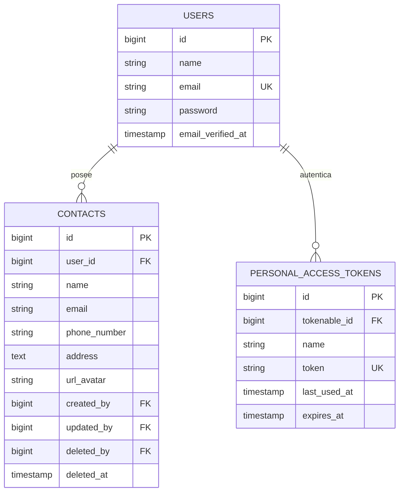

# Modelo de datos de Contacts API

```mermaid
erDiagram
    USERS ||--o{ CONTACTS : "posee"
    USERS ||--o{ PERSONAL_ACCESS_TOKENS : "autentica"

    USERS {
        bigint id PK
        string name
        string email UK
        string password
        timestamp email_verified_at
    }
    CONTACTS {
        bigint id PK
        bigint user_id FK
        string name
        string email
        string phone_number
        text address
        string url_avatar
        bigint created_by FK
        bigint updated_by FK
        bigint deleted_by FK
        timestamp deleted_at
    }
    PERSONAL_ACCESS_TOKENS {
        bigint id PK
        bigint tokenable_id FK
        string name
        string token UK
        timestamp last_used_at
        timestamp expires_at
    }
```
